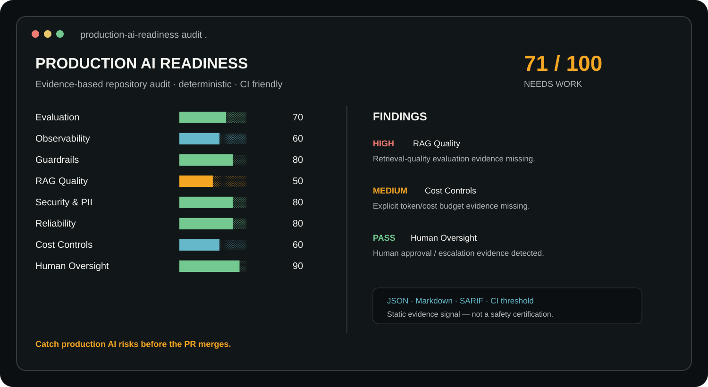

# Production AI Readiness

> **Audit an AI/LLM application before it reaches production.**

Production AI Readiness is an open-source Python CLI that performs a deterministic, evidence-based audit of an AI application's repository across **evaluation, observability, guardrails, RAG quality, security & PII, reliability, cost controls, and human oversight**.

It is a **readiness signal, not a certification**: the tool reports what it can prove from repository evidence and labels what still requires human verification.

<p align="center">
  
</p>

<p align="center"><strong>Catch production AI risks before the PR merges.</strong></p>

## Quick start

```bash
python -m pip install -e .
production-ai-readiness audit .
```

Reports:

```bash
production-ai-readiness audit . --format json --output readiness.json
production-ai-readiness audit . --format markdown --output readiness.md
production-ai-readiness audit . --format sarif --output readiness.sarif
production-ai-readiness audit . --fail-below 60
```

## See the signal change

The repository ships two small examples so you can see the audit behavior instead of taking the README's word for it.

```bash
# deliberately incomplete AI app
production-ai-readiness audit examples/sample-ai-app

# example with explicit production-readiness evidence
production-ai-readiness audit examples/production-ready
```

The second example includes evaluation, guardrails, retrieval, logging, PII handling, reliability controls, budgets/rate limits and human review. These are **static evidence demonstrations, not a production-safety certification**.

[Read the demo walkthrough →](docs/demo.md)

## What it checks

| Dimension | Repository evidence |
|---|---|
| **Evaluation** | eval/test directories, evaluation configuration, quality assertions |
| **Observability** | tracing, metrics, logging configuration and instrumentation |
| **Guardrails** | validation, policy/guardrail modules, structured input/output controls |
| **RAG Quality** | retrieval/reranking code plus retrieval evaluation evidence |
| **Security & PII** | secret hygiene, security/auth modules, PII/privacy handling |
| **Reliability** | retry, timeout, fallback and circuit-breaker evidence |
| **Cost Controls** | token/budget/rate-limit/caching controls |
| **Human Oversight** | approval, escalation and human-in-the-loop mechanisms |

## Scoring

Every check is deterministic and explainable. A failed check means **repository evidence was not detected**; it does not claim the runtime system is unsafe.

- **READY** — score >= 85 and no HIGH findings
- **NEEDS WORK** — score >= 60
- **NOT READY** — score < 60

## Design principles

1. Evidence over guesses.
2. Deterministic by default — no LLM call required.
3. No false certification.
4. Human-readable findings.
5. CI-friendly JSON output and exit thresholds.

## Limitations

Static repository evidence cannot prove runtime behavior, model quality, security posture, compliance, or operational readiness. Dynamic evaluation, red teaming, load testing, privacy review, infrastructure inspection and human architecture review remain necessary for high-risk systems.

## Roadmap

- richer framework-specific detectors
- packaged demo / release artifacts
- configurable rule weights
- SARIF output
- baseline/diff mode for pull requests
- optional runtime evidence adapters
- plugin API for organization-specific rules

## Author

Built by **[Uzair Khatri](https://uzairkhatri.com)** — Production AI Systems Architect.

[Website](https://uzairkhatri.com) · [LinkedIn](https://www.linkedin.com/in/uzair-khatri/) · [Production AI Playbook](https://uzairkhatri.com/ai-playbook/)

## License

MIT
